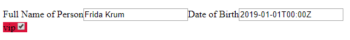

Generate HTML forms and bind hierarchical and tabular data with the help of [JSON Schema](https://json-schema.org).

Form-Chen supports master-detail relationships and undo/redo transaction management.

It uses [gridchen](https://github.com/decatur/gridchen) to produce Excel-like web-components for
tabular (aka table/grid/matrix) data. 

Edits on the original object are emitted as standard [JSON Patch](https://tools.ietf.org/html/rfc6902),
which can be directly passed to the back end.

Optionally, object properties can be specified by [JSON Pointers](https://tools.ietf.org/html/rfc6901) to be bound to given HTML-elements.

Formchen is written in plain EcmaScript 2017 modules and can be directly imported as such with any modern browser.

# Installation

Either
* Use a CDN such as
    * https://unpkg.com/formchen@0.1.3/webcomponent.js?module
    * or https://cdn.skypack.dev/formchen (a bit involved)
    * or https://decatur.github.io/formchen/formchen
* or git-clone a release
* or copy the formchen module folder
* or `pip install formchen`
* or `npm install formchen`

Note: cdn.jsdelivr.net currently does not support bare module specifiers.

# Usage

This is a basic form which runs standalone or can be loaded from https://decatur.github.io/formchen/usage.html.



```html
<!DOCTYPE html>
<div class="form-chen">
    <div id="/person"></div>
    <span style="font-size: x-large" id="/person/vip"></span>
</div>
<script type="module">
    import {createFormChen} from "https://decatur.github.io/formchen/formchen/webcomponent.js"

    const schema = {
        title: 'Person',
        pathPrefix: '/person',
        type: 'object',
        properties: {
            name: {
                title: 'Full Name of Person', type: 'string'
            },
            dateOfBirth: {
                title: 'Date of Birth', type: 'string', format: 'full-date'
            },
            vip: {
                type: 'boolean'
            }
        }
    };

    const data = {
        name: 'Frida Krum',
        dateOfBirth: '2019-01-01T00:00Z',
        vip: true
    };

    createFormChen(schema, data);
</script>

```

# Demos

See https://decatur.github.io/formchen

# Hosting Form-Chen

Deploy both [formchen](https://github.com/decatur/formchen/tree/master/formchen) and 
[gridchen](https://github.com/decatur/gridchen/tree/master/gridchen) directories from the respective git repositories. 
formchen depends on gridchen to be at the bare URL ``gridchen``, i.e. ``import "gridchen/webcomponent.js"``
So be sure you bundle or inplace your imports.

## NPM Install

⚠ Currently formchen is not registered with npmjs!

## Python PyPI Install
Using Python you can install the [formchen package](https://pypi.org/project/formchen/).
A Python routing example can be found in the provided dev server.

## Note on module resolving

The old way of module resolution is via 
[bare import specifiers](https://html.spec.whatwg.org/multipage/webappapis.html#resolve-a-module-specifier) 
such as ``import "gridchen/webcomponent.js"``. Note the missing slash at the beginning. 
This is usually handled by bundlers, which replace the bare import specifier with a relative path to the routed module location.
As we do not want to rely on any bundler, and because currently there is no Web browser standard for module resolution of bare import
specifiers, we opted for the relative URL approach.  


# Read Only

At any level, the schema can be marked `readOnly:true|false`, the default value being `false`.
The `readOnly` property is inherited by sub-schemas. 

# DOM Api and CSS Styling

The form is generated as a flat list of paired elements. The input elements are generated with the document ID corresponding to the JSON Pointer to its value.

Pairs           | Semantic
----------------|-----------
&lt;label/&gt; &lt;input&gt;     | For all scalar fields
&lt;label/&gt; &lt;select&gt;    | For all scalar fields having an enum type
&lt;label/&gt; &lt;checkbox&gt;  | For all scalar boolean fields
&lt;label&gt; &lt;grid-chen/&gt; &lt;/label&gt;| For all grid fields
&lt;label class=error/&gt;                   | For errors

In case a field has a unit, then the label will have a nested &lt;span class=unit/&gt; element.

No direct element style is applied.

Based on this flat list of paired elements, the layout can be tweaked using CSS Column Layout, CSS Grid Layout or CSS Flex Layout, or whatever. See the demos for examples.

# JavaScript Api

Please see the source code of the demos or [formchen TypeScript Definitions](formchen/formchen.d.ts) for the public JavaScript Api.

# Contribute

Form-Chen is written in plain EcmaScript 2017 modules with JSDocs type hinting.
There is no overhead related to transpiling or packing.
As tool I recommend either vscode or one of JetBrains IDEs (WebStorm, PyCharm).

## Dev Server

There is a FastAPI-based dev server in the dev_server directory.

## Unit Testing

After starting the dev server, navigate to
http://localhost:8000/gridchen/testing/suiterunner.html?testpath=/formchen/tests/

## Project Website

Formchen can be deployed to a static web server. We use Github Pages and serve from /docs of the master branch. 
The /docs folder is generated from project root by running
````bash
python build.py
````
This will substitute the bare import specifier `gridchen/` with `https://decatur.github.io/gridchen/gridchen/`.

Steps:
1. `python build.py`
2. Test web site locally by opening `./docs/index.html` (PyCharm: Open in browser) and navigating the site.
3. `git push`
4. Test web site on [Formchen Github Pages](https://decatur.github.io/formchen/index.html) 

## Python Package

````shell script
poetry build
````

## Python Publish

````shell script
poetry publish
````

## Publish as npm Package

Bump version in `fromchen/package.json` and `git tag`.

````bash
cd fromchen & npm publish
````


